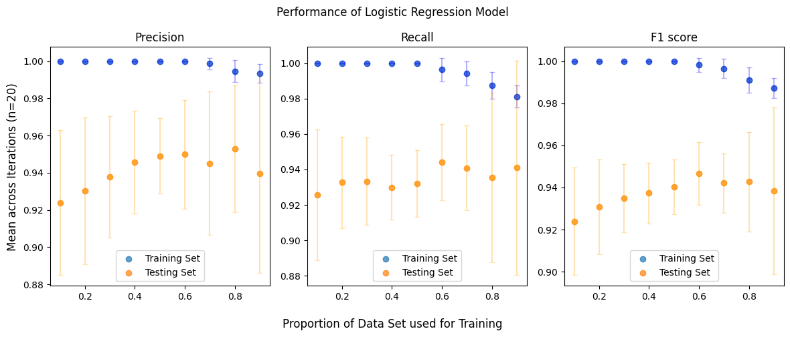
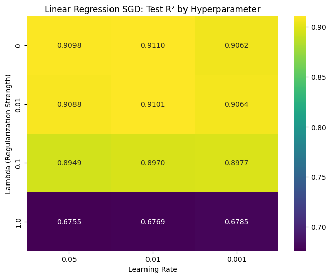

# ml-from-scratch-regression
McGill COMP 551 - Mini-Project 1: Scratch implementation of fundamental ML models (Linear/Logistic Regression)

- Gabriel Caballero (261108565)
- Adam Dufour(261193949)
- Charlotte Livingston (261043465)




## Project Overview
The repository contains implementations of two core models:
- Linear Regression: Solved via both the analytical closed-form solution and Mini-batch Stochastic Gradient Descent (SGD)
- Logistic Regression: Solved via Gradient Descent and Mini-batch SGD for binary classification

### Datasets
- Parkinson's Telemonitoring: Used for regression to predict motor UPDRS scores
- Breast Cancer Diagnostic: Used for binary classification to predict malignancy

## Prerequisites
* Python 3.8+ (we used Python 3.12.11)
* Packages in requirements.txt
```bash
pip install -r requirements.txt
```

## Running the Code
Notebook is structured in 3 main sections:
* Data Cleaning
* Models: the classes of ML models themselves
* Testing: contains a series of tests based on the project rubric
  * 

Launch the Jupyter Notebook / JupyterLab from your terminal (or use PyCharm/VSCode) and click run, all the tests will start running automatically
